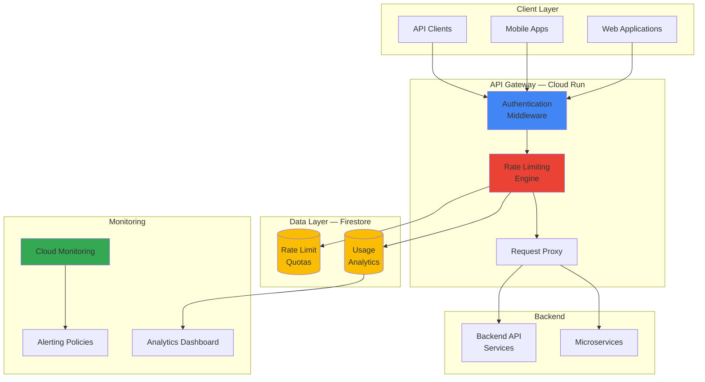

# API Rate Limiting and Analytics with Cloud Run and Firestore

## Problem

Modern API-driven applications struggle with uncontrolled usage that leads to service degradation, unexpected costs, and poor user experience. Without proper rate limiting and usage analytics, businesses cannot effectively monetize their APIs, protect backend resources from abuse, or make data-driven decisions about capacity planning and feature development.

## Solution

Build a serverless API gateway using Cloud Run that implements intelligent rate limiting with Firestore for real-time quota tracking and usage analytics. The solution provides automatic scaling, cost-effective resource usage, and comprehensive monitoring through Cloud Monitoring — enabling businesses to protect their APIs while gaining actionable insights into usage patterns.

## Architecture Diagram



## Prerequisites

1. Google Cloud account with billing enabled
2. Permissions: Cloud Run Admin, Firestore Admin, Cloud Build Editor
3. Google Cloud CLI (v450.0.0+) installed and configured
4. Docker installed locally
5. Python 3.9+ and familiarity with REST APIs
6. Estimated cost: **$0.50 – $2.00/day** (free tier eligible)

## Preparation

```bash
# Set environment variables
export PROJECT_ID=$(gcloud config get-value project)
export REGION="us-central1"
export SERVICE_NAME="api-rate-limiter"
RANDOM_SUFFIX=$(openssl rand -hex 3)

# Enable required APIs
gcloud services enable run.googleapis.com
gcloud services enable firestore.googleapis.com
gcloud services enable monitoring.googleapis.com
gcloud services enable cloudbuild.googleapis.com

# Create Firestore database (Native mode)
gcloud firestore databases create \
    --location=${REGION} \
    --type=firestore-native

# Create project directory
mkdir -p api-rate-limiting-analytics/src
cd api-rate-limiting-analytics

echo "Project configured"
```

## Steps

1. **Create the API Gateway Application**:

   Build a Flask application with authentication middleware, sliding-window rate limiting backed by Firestore transactions, and analytics logging.

   ```bash
   cat > src/main.py << 'PYEOF'
   import os
   import time
   import logging
   import hashlib
   from datetime import datetime, timezone, timedelta
   from functools import wraps

   from flask import Flask, request, jsonify, g
   from google.cloud import firestore

   app = Flask(__name__)
   db = firestore.Client()
   logging.basicConfig(level=logging.INFO)
   logger = logging.getLogger(__name__)

   # ── Configuration ────────────────────────────────────────────
   DEFAULT_RATE_LIMIT = 100        # requests per window
   RATE_WINDOW_SECONDS = 3600      # 1 hour sliding window

   # ── Rate Limiter ─────────────────────────────────────────────
   class RateLimiter:
       def __init__(self):
           self.collection = db.collection("rate_limits")

       def check_rate_limit(self, api_key: str) -> dict:
           """Transactional rate limit check using Firestore."""
           doc_ref = self.collection.document(hashlib.sha256(api_key.encode()).hexdigest())

           @firestore.transactional
           def update_in_transaction(transaction, ref):
               snapshot = ref.get(transaction=transaction)
               now = datetime.now(timezone.utc)
               window_start = now - timedelta(seconds=RATE_WINDOW_SECONDS)

               if snapshot.exists:
                   data = snapshot.to_dict()
                   # Remove expired request timestamps
                   requests = [ts for ts in data.get("requests", []) if ts > window_start]
               else:
                   requests = []

               remaining = DEFAULT_RATE_LIMIT - len(requests)

               if remaining <= 0:
                   return {"allowed": False, "remaining": 0,
                           "reset": int((requests[0] + timedelta(seconds=RATE_WINDOW_SECONDS)).timestamp())}

               requests.append(now)
               transaction.set(ref, {"requests": requests, "api_key_hash": doc_ref.id,
                                     "updated_at": now})

               return {"allowed": True, "remaining": remaining - 1,
                       "reset": int((now + timedelta(seconds=RATE_WINDOW_SECONDS)).timestamp())}

           transaction = db.transaction()
           return update_in_transaction(transaction, doc_ref)

   rate_limiter = RateLimiter()

   # ── Analytics Logger ─────────────────────────────────────────
   def log_request(api_key, endpoint, status_code, response_time_ms):
       db.collection("api_analytics").add({
           "api_key": api_key[:8] + "...",
           "endpoint": endpoint,
           "status_code": status_code,
           "response_time_ms": response_time_ms,
           "timestamp": datetime.now(timezone.utc),
           "ip_address": request.remote_addr,
           "user_agent": request.headers.get("User-Agent", ""),
       })

   # ── Middleware ────────────────────────────────────────────────
   def require_api_key(f):
       @wraps(f)
       def decorated(*args, **kwargs):
           api_key = request.headers.get("X-API-Key")
           if not api_key:
               return jsonify({"error": "Missing X-API-Key header"}), 401

           g.api_key = api_key
           g.start_time = time.time()

           # Check rate limit
           result = rate_limiter.check_rate_limit(api_key)
           if not result["allowed"]:
               log_request(api_key, request.path, 429,
                           int((time.time() - g.start_time) * 1000))
               resp = jsonify({"error": "Rate limit exceeded"})
               resp.headers["X-RateLimit-Limit"] = str(DEFAULT_RATE_LIMIT)
               resp.headers["X-RateLimit-Remaining"] = "0"
               resp.headers["X-RateLimit-Reset"] = str(result["reset"])
               return resp, 429

           response = f(*args, **kwargs)

           # Add rate limit headers
           if hasattr(response, "headers"):
               response.headers["X-RateLimit-Limit"] = str(DEFAULT_RATE_LIMIT)
               response.headers["X-RateLimit-Remaining"] = str(result["remaining"])
               response.headers["X-RateLimit-Reset"] = str(result["reset"])

           elapsed_ms = int((time.time() - g.start_time) * 1000)
           log_request(api_key, request.path, 200, elapsed_ms)
           return response

       return decorated

   # ── Endpoints ─────────────────────────────────────────────────
   @app.route("/health")
   def health():
       return jsonify({"status": "healthy", "timestamp": datetime.now(timezone.utc).isoformat()})

   @app.route("/api/v1/data")
   @require_api_key
   def get_data():
       return jsonify({
           "message": "Protected data",
           "timestamp": datetime.now(timezone.utc).isoformat(),
           "items": [
               {"id": 1, "name": "Widget A", "value": 42.5},
               {"id": 2, "name": "Widget B", "value": 17.3},
           ]
       })

   @app.route("/api/v1/analytics")
   @require_api_key
   def get_analytics():
       """Return usage analytics for the authenticated API key."""
       docs = (db.collection("api_analytics")
               .where("api_key", "==", g.api_key[:8] + "...")
               .order_by("timestamp", direction=firestore.Query.DESCENDING)
               .limit(50).stream())

       records = [doc.to_dict() for doc in docs]
       for r in records:
           r["timestamp"] = r["timestamp"].isoformat()
       return jsonify({"analytics": records, "count": len(records)})

   if __name__ == "__main__":
       app.run(host="0.0.0.0", port=int(os.environ.get("PORT", 8080)))
   PYEOF

   echo "API gateway application created"
   ```

2. **Create Dependencies and Dockerfile**:

   ```bash
   cat > requirements.txt << 'EOF'
   Flask==3.0.3
   google-cloud-firestore==2.21.0
   gunicorn==23.0.0
   EOF

   cat > Dockerfile << 'EOF'
   FROM python:3.11-slim

   WORKDIR /app
   RUN adduser --disabled-password --no-create-home appuser

   COPY requirements.txt .
   RUN pip install --no-cache-dir -r requirements.txt

   COPY src/ ./src/
   USER appuser

   ENV PYTHONUNBUFFERED=1
   EXPOSE 8080
   CMD ["gunicorn", "--bind", "0.0.0.0:8080", "--workers", "2", "--threads", "8", "src.main:app"]
   EOF

   echo "Dependencies and Dockerfile created"
   ```

3. **Build and Deploy to Cloud Run**:

   ```bash
   # Build container image
   gcloud builds submit --tag gcr.io/${PROJECT_ID}/${SERVICE_NAME}

   # Deploy to Cloud Run
   gcloud run deploy ${SERVICE_NAME} \
       --image gcr.io/${PROJECT_ID}/${SERVICE_NAME} \
       --platform managed \
       --region ${REGION} \
       --memory 1Gi \
       --cpu 1 \
       --concurrency 100 \
       --max-instances 10 \
       --min-instances 0 \
       --allow-unauthenticated

   # Capture the service URL
   export SERVICE_URL=$(gcloud run services describe ${SERVICE_NAME} \
       --region=${REGION} --format="value(status.url)")
   echo "Deployed: ${SERVICE_URL}"
   ```

4. **Set Up Firestore Security Rules**:

   ```bash
   cat > firestore.rules << 'EOF'
   rules_version = '2';
   service cloud.firestore {
     match /databases/{database}/documents {
       match /rate_limits/{document=**} {
         allow read, write: if true;
       }
       match /api_analytics/{document=**} {
         allow write: if true;
         allow read: if true;
       }
     }
   }
   EOF

   echo "Firestore rules created (apply via Firebase Console for production)"
   ```

5. **Configure Cloud Monitoring Dashboard and Alerts**:

   ```bash
   # Create alert policy for high error rates
   gcloud alpha monitoring policies create \
       --display-name="API High Error Rate" \
       --condition-display-name="Error rate > 10/min" \
       --condition-filter='resource.type="cloud_run_revision" AND resource.labels.service_name="${SERVICE_NAME}" AND metric.type="run.googleapis.com/request_count" AND metric.labels.response_code_class="5xx"' \
       --condition-threshold-value=10 \
       --condition-threshold-duration=300s \
       --combiner=OR

   echo "Monitoring alerts configured"
   ```

6. **Test the API Gateway**:

   ```bash
   # Generate test API keys
   export TEST_API_KEY_1="test-key-$(openssl rand -hex 16)"
   export TEST_API_KEY_2="test-key-$(openssl rand -hex 16)"

   # Test health endpoint (no auth)
   curl -s ${SERVICE_URL}/health | python3 -m json.tool

   # Test authenticated endpoint
   curl -s -H "X-API-Key: ${TEST_API_KEY_1}" ${SERVICE_URL}/api/v1/data | python3 -m json.tool

   # Observe rate limit headers
   curl -si -H "X-API-Key: ${TEST_API_KEY_1}" ${SERVICE_URL}/api/v1/data 2>&1 | grep -i "x-ratelimit"

   # Fetch analytics
   curl -s -H "X-API-Key: ${TEST_API_KEY_1}" ${SERVICE_URL}/api/v1/analytics | python3 -m json.tool
   ```

## Validation & Testing

1. **API gateway responds with rate limit headers:**

   ```bash
   curl -si -H "X-API-Key: ${TEST_API_KEY_1}" ${SERVICE_URL}/api/v1/data 2>&1 | head -20
   ```

   Expected: `X-RateLimit-Limit: 100`, `X-RateLimit-Remaining: 99`, `X-RateLimit-Reset: <unix_ts>`

2. **Rate limiting enforced after quota exhausted:**

   ```bash
   for i in $(seq 1 105); do
       STATUS=$(curl -s -o /dev/null -w "%{http_code}" \
           -H "X-API-Key: ${TEST_API_KEY_2}" ${SERVICE_URL}/api/v1/data)
       echo "Request $i: HTTP $STATUS"
   done
   ```

   Expected: First 100 return `200`, remaining return `429`.

3. **Analytics collected in Firestore:**

   ```bash
   sleep 5
   curl -s -H "X-API-Key: ${TEST_API_KEY_1}" ${SERVICE_URL}/api/v1/analytics | python3 -m json.tool
   ```

   Expected: JSON array with request timestamps, response times, and endpoint paths.

## Cleanup

```bash
# Delete Cloud Run service
gcloud run services delete ${SERVICE_NAME} --region=${REGION} --quiet

# Delete container images
gcloud container images delete gcr.io/${PROJECT_ID}/${SERVICE_NAME} --force-delete-tags --quiet

# Delete Firestore collections (manual or via script)
echo "Delete 'rate_limits' and 'api_analytics' collections from Firestore Console"

# Unset environment variables
unset PROJECT_ID REGION SERVICE_NAME SERVICE_URL TEST_API_KEY_1 TEST_API_KEY_2

echo "All resources cleaned up"
```

## Discussion

This project demonstrates several concepts tested on the Professional Data Engineering exam: **serverless compute** (Cloud Run auto-scaling), **NoSQL document databases** (Firestore for real-time state), and **API management** patterns. The transactional rate limiter shows understanding of distributed consistency — Firestore transactions prevent race conditions that would allow quota bypass under concurrent requests.

The sliding-window approach (storing individual request timestamps rather than simple counters) enables flexible rate limiting policies: per-minute, per-hour, or burst-based limits can all be derived from the same data. The analytics collection creates a secondary data stream useful for capacity planning, billing, and abuse detection.

From a portfolio perspective, this project is compelling because it demonstrates a production-ready pattern that every API-driven company needs. The rate limit headers (`X-RateLimit-*`) follow industry standards (GitHub, Stripe, Twitter all use this convention), and the monitoring integration shows awareness of operational concerns.

> **Tip**: During interviews, highlight the Firestore transaction pattern — it shows you understand distributed systems challenges beyond just "use a database."

## Challenge

1. **Multi-tier rate limiting**: Implement free / premium / enterprise tiers with different quotas stored in Firestore, and automatic tier upgrades via a billing webhook.
2. **Real-time analytics dashboard**: Add a Streamlit dashboard that queries Firestore analytics in real time and shows request volume, latency percentiles, and top consumers.
3. **Intelligent rate limiting**: Use Vertex AI to detect anomalous request patterns (DDoS, credential stuffing) and dynamically adjust rate limits.
4. **Global load distribution**: Deploy to multiple Cloud Run regions behind a Global HTTP Load Balancer with geo-aware rate limiting.
5. **API monetization**: Add usage-based billing with Stripe integration, generating invoices based on Firestore analytics data.
