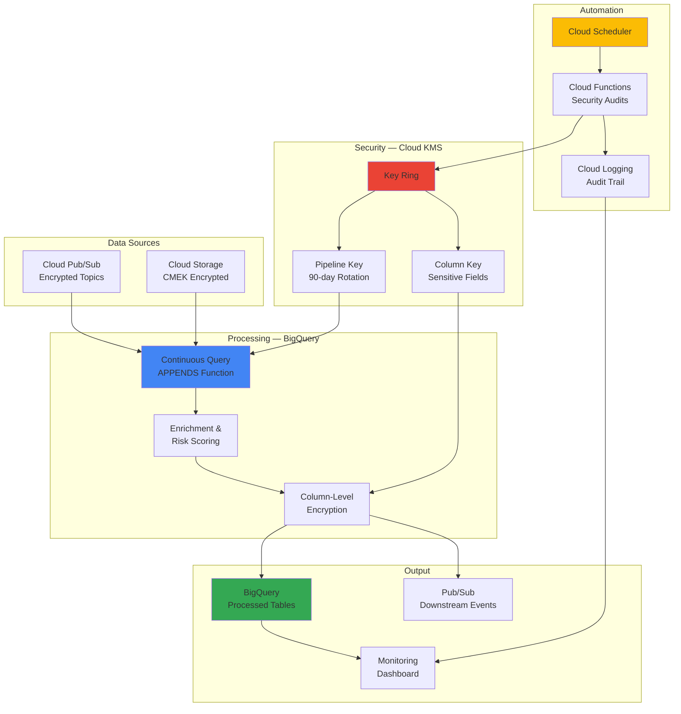

# Data Pipeline Automation with BigQuery Continuous Queries and Cloud KMS

## Problem

Enterprise data pipelines demand real-time processing combined with strong security and compliance guarantees. Traditional batch ETL approaches introduce latency and leave gaps where unencrypted data sits at rest or in transit. Teams must manually coordinate encryption key rotation, audit logging, and pipeline scheduling — creating operational overhead and compliance risk. The challenge is building a pipeline that processes data continuously, encrypts it at every stage, and generates compliance audit trails without manual intervention.

## Solution

Build a self-monitoring, security-first data pipeline using BigQuery Continuous Queries for always-on SQL transformations and Cloud KMS for customer-managed encryption keys (CMEK). The pipeline ingests streaming events via Pub/Sub, processes them in real-time with BigQuery's `APPENDS` function, applies column-level encryption for sensitive fields, and exports enriched results — all while Cloud Scheduler automates key rotation and security audits.

## Architecture Diagram



## Prerequisites

1. Google Cloud account with billing enabled
2. Permissions: BigQuery Admin, Cloud KMS Admin, Pub/Sub Admin, Cloud Functions Developer
3. Google Cloud CLI installed and configured
4. Basic SQL knowledge and familiarity with encryption concepts
5. Estimated cost: **$5 – $15** for demo run (BigQuery continuous queries and KMS key operations)

> **Note**: BigQuery continuous queries run until cancelled and incur slot charges. Stop them after testing to avoid ongoing costs.

## Preparation

```bash
# Set environment variables
export PROJECT_ID=$(gcloud config get-value project)
export REGION="us-central1"
RANDOM_SUFFIX=$(openssl rand -hex 3)

# Enable required APIs
gcloud services enable bigquery.googleapis.com
gcloud services enable cloudkms.googleapis.com
gcloud services enable pubsub.googleapis.com
gcloud services enable cloudfunctions.googleapis.com
gcloud services enable cloudscheduler.googleapis.com
gcloud services enable logging.googleapis.com
gcloud services enable storage.googleapis.com

# Create BigQuery dataset
export BQ_DATASET="secure_pipeline_${RANDOM_SUFFIX}"
bq mk --dataset --location=${REGION} ${PROJECT_ID}:${BQ_DATASET}

# Create project directory
mkdir -p data-pipeline-automation/src
cd data-pipeline-automation

echo "Project configured"
echo "BQ dataset: ${BQ_DATASET}"
```

## Steps

1. **Create Cloud KMS Key Ring and Encryption Keys**:

   Set up a KMS key ring with two keys: one for pipeline-level CMEK encryption and one for column-level encryption of sensitive fields. Configure 90-day automatic rotation.

   ```bash
   # Create key ring
   export KEYRING_NAME="pipeline-keyring-${RANDOM_SUFFIX}"
   gcloud kms keyrings create ${KEYRING_NAME} \
       --location=${REGION}

   # Create pipeline encryption key with 90-day rotation
   export PIPELINE_KEY="pipeline-cmek-key"
   gcloud kms keys create ${PIPELINE_KEY} \
       --location=${REGION} \
       --keyring=${KEYRING_NAME} \
       --purpose=encryption \
       --rotation-period=7776000s \
       --next-rotation-time=$(date -u -d "+90 days" +%Y-%m-%dT%H:%M:%SZ)

   # Create column-level encryption key
   export COLUMN_KEY="column-encrypt-key"
   gcloud kms keys create ${COLUMN_KEY} \
       --location=${REGION} \
       --keyring=${KEYRING_NAME} \
       --purpose=encryption

   # Grant BigQuery service account access to the keys
   export BQ_SA="bq-${PROJECT_ID}@bigquery-encryption.iam.gserviceaccount.com"
   gcloud kms keys add-iam-policy-binding ${PIPELINE_KEY} \
       --location=${REGION} \
       --keyring=${KEYRING_NAME} \
       --member="serviceAccount:${BQ_SA}" \
       --role="roles/cloudkms.cryptoKeyEncrypterDecrypter"

   echo "KMS infrastructure created"
   ```

2. **Create CMEK-Encrypted BigQuery Tables**:

   ```bash
   export KMS_KEY_PATH="projects/${PROJECT_ID}/locations/${REGION}/keyRings/${KEYRING_NAME}/cryptoKeys/${PIPELINE_KEY}"

   # Raw events table (encrypted at rest with CMEK)
   bq mk --table \
       --destination_kms_key=${KMS_KEY_PATH} \
       --schema='event_id:STRING,event_type:STRING,user_id:STRING,email:STRING,payload:STRING,risk_score:FLOAT,timestamp:TIMESTAMP,ingested_at:TIMESTAMP' \
       ${PROJECT_ID}:${BQ_DATASET}.raw_events

   # Processed events table
   bq mk --table \
       --destination_kms_key=${KMS_KEY_PATH} \
       --schema='event_id:STRING,event_type:STRING,user_id_masked:STRING,email_encrypted:BYTES,risk_score:FLOAT,risk_level:STRING,processed_at:TIMESTAMP' \
       ${PROJECT_ID}:${BQ_DATASET}.processed_events

   # Audit log table
   bq mk --table \
       --destination_kms_key=${KMS_KEY_PATH} \
       --schema='audit_id:STRING,action:STRING,resource:STRING,status:STRING,details:STRING,timestamp:TIMESTAMP' \
       ${PROJECT_ID}:${BQ_DATASET}.audit_log

   echo "Encrypted BigQuery tables created"
   ```

3. **Set Up Encrypted Pub/Sub Ingestion**:

   ```bash
   # Create encrypted Pub/Sub topic
   export TOPIC_NAME="pipeline-events-${RANDOM_SUFFIX}"
   gcloud pubsub topics create ${TOPIC_NAME} \
       --message-encryption-key-name=${KMS_KEY_PATH}

   # Create BigQuery subscription (direct ingestion)
   gcloud pubsub subscriptions create "${TOPIC_NAME}-bq-sub" \
       --topic=${TOPIC_NAME} \
       --bigquery-table="${PROJECT_ID}:${BQ_DATASET}.raw_events" \
       --write-metadata

   echo "Encrypted Pub/Sub topic created"
   ```

4. **Deploy BigQuery Continuous Query**:

   The continuous query monitors the `raw_events` table using the `APPENDS` function, enriches each row with risk scoring, masks PII fields, and writes to the processed table — all in real-time SQL.

   ```sql
   -- Run in BigQuery Console or via bq query
   CREATE OR REPLACE CONTINUOUS QUERY `secure_pipeline.process_events`
   OPTIONS(
     destination_table = 'processed_events',
     connection = 'default'
   )
   AS
   SELECT
       event_id,
       event_type,
       -- Mask user ID (keep first 4 chars)
       CONCAT(SUBSTR(user_id, 1, 4), '****') AS user_id_masked,
       -- Column-level encryption for email
       AEAD.ENCRYPT(
           KEYS.KEYSET_CHAIN(
               'gcp-kms://projects/PROJECT_ID/locations/REGION/keyRings/KEYRING/cryptoKeys/column-encrypt-key',
               FROM_BASE64('KEYSET_BYTES')
           ),
           CAST(email AS BYTES),
           CAST(event_id AS BYTES)
       ) AS email_encrypted,
       risk_score,
       -- Derive risk level
       CASE
           WHEN risk_score >= 0.8 THEN 'CRITICAL'
           WHEN risk_score >= 0.5 THEN 'HIGH'
           WHEN risk_score >= 0.3 THEN 'MEDIUM'
           ELSE 'LOW'
       END AS risk_level,
       CURRENT_TIMESTAMP() AS processed_at
   FROM APPENDS(TABLE `secure_pipeline.raw_events`)
   WHERE timestamp > TIMESTAMP_SUB(CURRENT_TIMESTAMP(), INTERVAL 1 HOUR);
   ```

   > **Note**: Replace `PROJECT_ID`, `REGION`, `KEYRING`, and `KEYSET_BYTES` with your actual values. Generate the keyset bytes using the Cloud KMS API.

5. **Create Cloud Function for Security Audits**:

   ```bash
   mkdir -p src/audit_function

   cat > src/audit_function/main.py << 'PYEOF'
   import os
   import uuid
   from datetime import datetime, timezone
   from google.cloud import bigquery, kms_v1

   PROJECT_ID = os.environ.get("PROJECT_ID")
   REGION = os.environ.get("REGION", "us-central1")
   BQ_DATASET = os.environ.get("BQ_DATASET")
   KEYRING = os.environ.get("KEYRING_NAME")

   bq_client = bigquery.Client()
   kms_client = kms_v1.KeyManagementServiceClient()


   def security_audit(request):
       """Automated security audit: verify key status and log results."""
       results = []

       # Check KMS key versions
       parent = f"projects/{PROJECT_ID}/locations/{REGION}/keyRings/{KEYRING}"
       for key in kms_client.list_crypto_keys(request={"parent": parent}):
           primary = key.primary
           results.append({
               "resource": key.name.split("/")[-1],
               "status": "ENABLED" if primary.state.name == "ENABLED" else "WARNING",
               "details": f"Algorithm: {primary.algorithm.name}, Created: {primary.create_time.isoformat()}"
           })

       # Check continuous query status
       query = f"""
           SELECT job_id, state, creation_time
           FROM `{PROJECT_ID}.{BQ_DATASET}.INFORMATION_SCHEMA.JOBS`
           WHERE job_type = 'QUERY' AND state = 'RUNNING'
           ORDER BY creation_time DESC LIMIT 5
       """
       try:
           rows = list(bq_client.query(query).result())
           results.append({
               "resource": "continuous_queries",
               "status": "HEALTHY" if rows else "WARNING",
               "details": f"{len(rows)} active queries"
           })
       except Exception as e:
           results.append({"resource": "continuous_queries", "status": "ERROR", "details": str(e)})

       # Write audit results to BigQuery
       table_ref = f"{PROJECT_ID}.{BQ_DATASET}.audit_log"
       rows_to_insert = [
           {
               "audit_id": str(uuid.uuid4()),
               "action": "SECURITY_AUDIT",
               "resource": r["resource"],
               "status": r["status"],
               "details": r["details"],
               "timestamp": datetime.now(timezone.utc).isoformat(),
           }
           for r in results
       ]
       bq_client.insert_rows_json(table_ref, rows_to_insert)

       return {"audit_results": results, "timestamp": datetime.now(timezone.utc).isoformat()}
   PYEOF

   cat > src/audit_function/requirements.txt << 'EOF'
   google-cloud-bigquery>=3.17.0
   google-cloud-kms>=2.21.0
   functions-framework>=3.5.0
   EOF

   echo "Audit function created"
   ```

6. **Deploy the Audit Function and Scheduler**:

   ```bash
   # Deploy Cloud Function
   gcloud functions deploy security-audit \
       --gen2 \
       --runtime=python311 \
       --region=${REGION} \
       --source=src/audit_function \
       --entry-point=security_audit \
       --trigger-http \
       --memory=256Mi \
       --set-env-vars="PROJECT_ID=${PROJECT_ID},REGION=${REGION},BQ_DATASET=${BQ_DATASET},KEYRING_NAME=${KEYRING_NAME}"

   export AUDIT_URL=$(gcloud functions describe security-audit \
       --region=${REGION} --format="value(serviceConfig.uri)")

   # Schedule hourly security audits
   gcloud scheduler jobs create http security-audit-hourly \
       --location=${REGION} \
       --schedule="0 * * * *" \
       --uri="${AUDIT_URL}" \
       --http-method=GET \
       --oidc-service-account-email="${PROJECT_ID}@appspot.gserviceaccount.com"

   echo "Audit function deployed and scheduled hourly"
   ```

7. **Publish Test Events**:

   ```bash
   cat > src/publish_test.py << 'PYEOF'
   import json
   import uuid
   import random
   from datetime import datetime, timezone
   from google.cloud import pubsub_v1
   import os

   publisher = pubsub_v1.PublisherClient()
   topic_path = publisher.topic_path(os.environ["PROJECT_ID"], os.environ["TOPIC_NAME"])

   EVENT_TYPES = ["login", "purchase", "transfer", "password_change", "account_update"]

   for i in range(50):
       event = {
           "event_id": str(uuid.uuid4()),
           "event_type": random.choice(EVENT_TYPES),
           "user_id": f"user-{random.randint(1000, 9999)}",
           "email": f"user{random.randint(1, 100)}@example.com",
           "payload": json.dumps({"amount": round(random.uniform(1, 5000), 2)}),
           "risk_score": round(random.uniform(0, 1), 3),
           "timestamp": datetime.now(timezone.utc).isoformat(),
       }
       publisher.publish(topic_path, json.dumps(event).encode("utf-8"))

   print("Published 50 test events")
   PYEOF

   python3 src/publish_test.py
   ```

8. **Set Up Monitoring and Alerting**:

   ```bash
   # Create log-based metric for high-risk events
   gcloud logging metrics create high-risk-events \
       --description="Events with risk_score >= 0.8" \
       --filter='resource.type="bigquery_resource" AND jsonPayload.risk_level="CRITICAL"'

   # Create alert policy
   gcloud alpha monitoring policies create \
       --display-name="High Risk Event Spike" \
       --condition-display-name="Critical risk events > 5/min" \
       --condition-filter='metric.type="logging.googleapis.com/user/high-risk-events"' \
       --condition-threshold-value=5 \
       --condition-threshold-duration=300s \
       --combiner=OR

   echo "Monitoring configured"
   ```

## Validation & Testing

1. **Verify encrypted Pub/Sub delivery to BigQuery:**

   ```bash
   bq query --use_legacy_sql=false \
       "SELECT COUNT(*) as total, MIN(timestamp) as earliest, MAX(timestamp) as latest
        FROM \`${PROJECT_ID}.${BQ_DATASET}.raw_events\`"
   ```

   Expected: 50 rows with recent timestamps.

2. **Verify continuous query processing:**

   ```bash
   bq query --use_legacy_sql=false \
       "SELECT event_id, event_type, user_id_masked, risk_level, processed_at
        FROM \`${PROJECT_ID}.${BQ_DATASET}.processed_events\`
        ORDER BY processed_at DESC LIMIT 10"
   ```

   Expected: Rows with masked user IDs (`user****`), encrypted emails, and risk levels.

3. **Verify KMS key status:**

   ```bash
   gcloud kms keys list \
       --location=${REGION} \
       --keyring=${KEYRING_NAME} \
       --format="table(name.basename(),purpose,primary.state,primary.algorithm)"
   ```

   Expected: Two keys, both `ENABLED`, with `GOOGLE_SYMMETRIC_ENCRYPTION`.

4. **Verify audit trail:**

   ```bash
   bq query --use_legacy_sql=false \
       "SELECT * FROM \`${PROJECT_ID}.${BQ_DATASET}.audit_log\` ORDER BY timestamp DESC LIMIT 5"
   ```

   Expected: Audit records from the scheduled security function.

## Cleanup

```bash
# Cancel continuous queries
bq ls --jobs --all --max_results=20 -q ${PROJECT_ID} | grep RUNNING | awk '{print $1}' | \
    xargs -I {} bq cancel {}

# Delete Cloud Scheduler job
gcloud scheduler jobs delete security-audit-hourly --location=${REGION} --quiet

# Delete Cloud Function
gcloud functions delete security-audit --region=${REGION} --quiet

# Delete Pub/Sub resources
gcloud pubsub subscriptions delete "${TOPIC_NAME}-bq-sub" --quiet
gcloud pubsub topics delete ${TOPIC_NAME} --quiet

# Delete BigQuery dataset
bq rm -r -f ${PROJECT_ID}:${BQ_DATASET}

# Delete KMS keys (schedule for destruction — cannot be immediately deleted)
gcloud kms keys versions destroy 1 \
    --location=${REGION} --keyring=${KEYRING_NAME} --key=${PIPELINE_KEY} --quiet
gcloud kms keys versions destroy 1 \
    --location=${REGION} --keyring=${KEYRING_NAME} --key=${COLUMN_KEY} --quiet

echo "All resources cleaned up (KMS keys scheduled for destruction)"
```

## Discussion

This project demonstrates a critical pattern for the Professional Data Engineering exam: **security-first pipeline design** with customer-managed encryption keys. BigQuery Continuous Queries are a relatively new feature that replaces the need for separate streaming infrastructure (Dataflow) for simpler real-time transformations — the exam tests whether candidates know when to use continuous queries vs. Dataflow.

The KMS integration shows three layers of encryption: **topic-level** (Pub/Sub CMEK), **table-level** (BigQuery CMEK), and **column-level** (AEAD encryption for PII fields). This maps directly to exam scenarios about data protection at rest and in transit, and CMEK vs. Google-managed encryption keys.

The automated security audit function demonstrates **operational maturity** — a key differentiator in portfolio projects. Rather than just building a pipeline, this project shows awareness of ongoing compliance requirements: key rotation verification, pipeline health monitoring, and audit trail generation.

> **Tip**: When presenting this project, emphasize the continuous query + KMS combination. Most candidates only know Dataflow for streaming — showing BigQuery continuous queries demonstrates awareness of the latest GCP capabilities.

## Challenge

1. **Multi-region encryption**: Extend the pipeline to replicate processed data to a second region with separate KMS keys, demonstrating cross-region encryption management.
2. **Data masking policies**: Implement BigQuery column-level security with data masking rules that apply different views for different IAM roles.
3. **Compliance reporting**: Build a Cloud Function that generates weekly compliance reports (key rotation status, encryption coverage, access patterns) and emails them via SendGrid.
4. **Real-time anomaly detection**: Add a continuous query that detects anomalous risk score patterns and publishes alerts to a separate Pub/Sub topic.
5. **Pipeline versioning**: Implement blue-green deployment for continuous queries, allowing zero-downtime updates to transformation logic.
