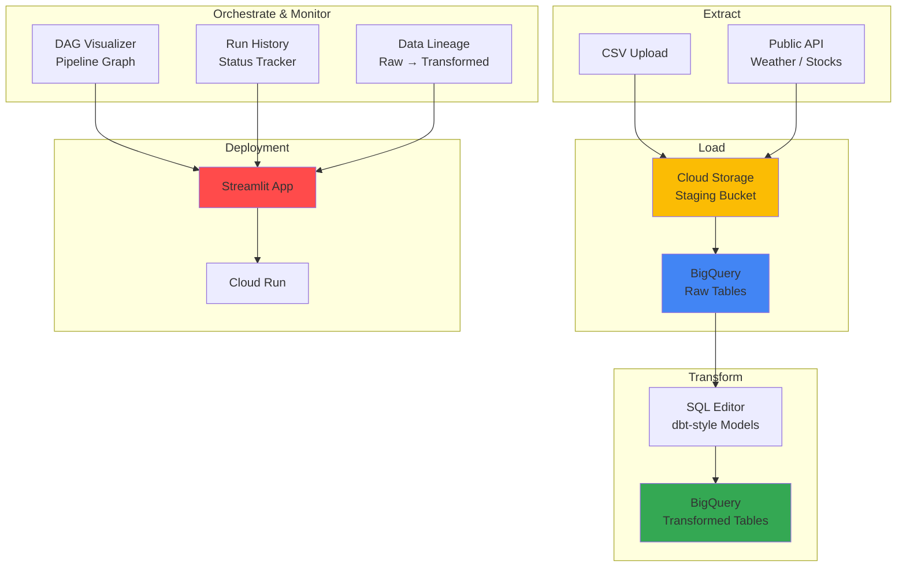

# ELT Pipeline Builder & Orchestrator with Streamlit, BigQuery, and Cloud Storage

## Problem

Data engineering teams frequently build ELT (Extract-Load-Transform) pipelines that ingest raw data from various sources, stage it in cloud storage, load it into a data warehouse, and apply SQL transformations. Building these pipelines typically requires stitching together multiple CLI tools, writing Airflow DAGs from scratch, and manually tracking pipeline runs. There is no lightweight, visual tool that lets engineers prototype, visualize, and execute ELT workflows interactively — making it difficult to demonstrate pipeline orchestration skills or quickly validate new data sources.

## Solution

This project creates an interactive ELT pipeline builder using Streamlit. Users walk through a step-by-step wizard: Extract data from CSV uploads or public APIs → Load raw data into GCS staging and then BigQuery → Transform using a SQL editor with dbt-style model patterns. The app visualizes the pipeline as a DAG, tracks run history, and shows data lineage from raw to transformed tables. Deployed on Cloud Run, it serves as a portfolio demonstration of orchestration, transformation, and data warehouse skills.

## Architecture Diagram



## Prerequisites

1. Google Cloud account with BigQuery, Cloud Storage, and Cloud Run APIs enabled
2. Google Cloud CLI installed and configured (or Cloud Shell)
3. Python 3.9+ installed locally
4. Docker installed (for Cloud Run deployment)
5. Basic knowledge of SQL, ELT patterns, and pipeline orchestration concepts
6. Estimated cost: **$0 – $5** (BigQuery free tier covers most operations; GCS charges are minimal)

> **Note**: This project uses BigQuery and GCS within free-tier limits for typical portfolio demonstrations. Monitor billing for larger datasets.

## Preparation

```bash
# Set environment variables
export PROJECT_ID=$(gcloud config get-value project)
export REGION="us-central1"
RANDOM_SUFFIX=$(openssl rand -hex 3)

# Enable required APIs
gcloud services enable bigquery.googleapis.com
gcloud services enable storage.googleapis.com
gcloud services enable run.googleapis.com
gcloud services enable artifactregistry.googleapis.com

# Create GCS staging bucket
export STAGING_BUCKET="elt-staging-${RANDOM_SUFFIX}"
gsutil mb -p ${PROJECT_ID} -c STANDARD -l ${REGION} gs://${STAGING_BUCKET}

# Create BigQuery dataset for raw and transformed tables
export BQ_DATASET="elt_pipeline"
bq mk --dataset --location=${REGION} ${PROJECT_ID}:${BQ_DATASET}

# Create project directory
mkdir -p elt-pipeline-builder/src
cd elt-pipeline-builder

echo "✅ Project configured"
echo "✅ Staging bucket: ${STAGING_BUCKET}"
echo "✅ BQ dataset: ${BQ_DATASET}"
```

## Steps

1. **Create the Extract Module**:

   The extract module handles pulling data from two source types: local CSV file uploads and public REST APIs (e.g., Open-Meteo weather API). Each extractor returns a Pandas DataFrame and metadata about the extraction.

   ```bash
   cat > src/__init__.py << 'PYEOF'
PYEOF

   cat > src/extract.py << 'PYEOF'
import pandas as pd
import requests
from datetime import datetime, timezone


def extract_csv(uploaded_file) -> tuple[pd.DataFrame, dict]:
    """Extract data from an uploaded CSV file."""
    df = pd.read_csv(uploaded_file)
    metadata = {
        "source": "csv_upload",
        "filename": uploaded_file.name,
        "rows": len(df),
        "columns": len(df.columns),
        "extracted_at": datetime.now(timezone.utc).isoformat(),
    }
    return df, metadata


def extract_weather_api(latitude: float = 52.52, longitude: float = 13.41, days: int = 7) -> tuple[pd.DataFrame, dict]:
    """Extract weather data from Open-Meteo public API (no API key needed)."""
    url = "https://api.open-meteo.com/v1/forecast"
    params = {
        "latitude": latitude,
        "longitude": longitude,
        "daily": "temperature_2m_max,temperature_2m_min,precipitation_sum,windspeed_10m_max",
        "past_days": days,
        "forecast_days": 1,
        "timezone": "UTC",
    }
    response = requests.get(url, params=params, timeout=30)
    response.raise_for_status()
    data = response.json()

    daily = data["daily"]
    df = pd.DataFrame({
        "date": daily["time"],
        "temp_max_c": daily["temperature_2m_max"],
        "temp_min_c": daily["temperature_2m_min"],
        "precipitation_mm": daily["precipitation_sum"],
        "windspeed_max_kmh": daily["windspeed_10m_max"],
        "latitude": latitude,
        "longitude": longitude,
    })

    metadata = {
        "source": "open_meteo_api",
        "latitude": latitude,
        "longitude": longitude,
        "rows": len(df),
        "columns": len(df.columns),
        "extracted_at": datetime.now(timezone.utc).isoformat(),
    }
    return df, metadata
PYEOF

   echo "✅ Extract module created"
   ```

2. **Create the Load Module**:

   The load module handles staging raw data in GCS (as Parquet for efficiency) and then loading it into BigQuery raw tables. This two-step load pattern (GCS → BigQuery) is a production best practice for auditability and reprocessing.

   ```bash
   cat > src/load.py << 'PYEOF'
import pandas as pd
from google.cloud import storage, bigquery
from datetime import datetime, timezone
import os
import io


def stage_to_gcs(df: pd.DataFrame, bucket_name: str, source_name: str) -> str:
    """Stage a DataFrame as a Parquet file in GCS. Returns the GCS URI."""
    client = storage.Client()
    bucket = client.bucket(bucket_name)

    timestamp = datetime.now(timezone.utc).strftime("%Y%m%d_%H%M%S")
    blob_path = f"staging/{source_name}/{timestamp}.parquet"

    buffer = io.BytesIO()
    df.to_parquet(buffer, index=False)
    buffer.seek(0)

    blob = bucket.blob(blob_path)
    blob.upload_from_file(buffer, content_type="application/octet-stream")

    gcs_uri = f"gs://{bucket_name}/{blob_path}"
    return gcs_uri


def load_to_bigquery(df: pd.DataFrame, project: str, dataset: str, table_name: str) -> dict:
    """Load a DataFrame into a BigQuery table (append mode)."""
    client = bigquery.Client(project=project)
    table_id = f"{project}.{dataset}.raw_{table_name}"

    job_config = bigquery.LoadJobConfig(
        write_disposition=bigquery.WriteDisposition.WRITE_APPEND,
        autodetect=True,
    )

    job = client.load_table_from_dataframe(df, table_id, job_config=job_config)
    job.result()  # Wait for completion

    table = client.get_table(table_id)
    return {
        "table_id": table_id,
        "rows_loaded": len(df),
        "total_rows": table.num_rows,
        "loaded_at": datetime.now(timezone.utc).isoformat(),
    }


def list_staged_files(bucket_name: str) -> list[dict]:
    """List all staged files in the GCS bucket."""
    client = storage.Client()
    bucket = client.bucket(bucket_name)
    blobs = bucket.list_blobs(prefix="staging/")

    files = []
    for blob in blobs:
        files.append({
            "path": f"gs://{bucket_name}/{blob.name}",
            "size_bytes": blob.size,
            "created": blob.time_created.isoformat() if blob.time_created else "",
        })
    return files
PYEOF

   echo "✅ Load module created"
   ```

3. **Create the Transform Module**:

   The transform module executes SQL transformations in BigQuery, implementing a dbt-style `CREATE OR REPLACE TABLE ... AS SELECT` pattern. It also tracks transformation lineage and run history.

   ```bash
   cat > src/transform.py << 'PYEOF'
import pandas as pd
from google.cloud import bigquery
from datetime import datetime, timezone


SAMPLE_TRANSFORMS = {
    "daily_weather_summary": {
        "description": "Aggregate weather data into daily summaries with temperature range",
        "sql": """
            SELECT
                date,
                latitude,
                longitude,
                temp_max_c,
                temp_min_c,
                temp_max_c - temp_min_c AS temp_range_c,
                precipitation_mm,
                windspeed_max_kmh,
                CASE
                    WHEN precipitation_mm > 10 THEN 'heavy_rain'
                    WHEN precipitation_mm > 2 THEN 'light_rain'
                    ELSE 'dry'
                END AS weather_category
            FROM `{project}.{dataset}.raw_weather`
        """,
    },
    "data_quality_flags": {
        "description": "Add quality flags for null values and outlier detection",
        "sql": """
            SELECT
                *,
                IF(temp_max_c IS NULL OR temp_min_c IS NULL, TRUE, FALSE) AS has_null_temp,
                IF(temp_max_c > 50 OR temp_min_c < -50, TRUE, FALSE) AS is_outlier,
                CURRENT_TIMESTAMP() AS transformed_at
            FROM `{project}.{dataset}.raw_weather`
        """,
    },
}


def run_transform(project: str, dataset: str, model_name: str, sql: str) -> dict:
    """Execute a SQL transformation as CREATE OR REPLACE TABLE."""
    client = bigquery.Client(project=project)
    target_table = f"{project}.{dataset}.transformed_{model_name}"

    full_sql = f"CREATE OR REPLACE TABLE `{target_table}` AS\n{sql}"

    job = client.query(full_sql)
    job.result()  # Wait for completion

    table = client.get_table(target_table)

    return {
        "model_name": model_name,
        "target_table": target_table,
        "rows_created": table.num_rows,
        "executed_at": datetime.now(timezone.utc).isoformat(),
        "status": "SUCCESS",
    }


def get_table_lineage(project: str, dataset: str) -> list[dict]:
    """Build a simple lineage graph from raw → transformed tables."""
    client = bigquery.Client(project=project)
    tables = list(client.list_tables(f"{project}.{dataset}"))

    lineage = []
    raw_tables = [t.table_id for t in tables if t.table_id.startswith("raw_")]
    transformed_tables = [t.table_id for t in tables if t.table_id.startswith("transformed_")]

    for t in transformed_tables:
        base_name = t.replace("transformed_", "")
        source = f"raw_{base_name}" if f"raw_{base_name}" in raw_tables else "unknown"
        lineage.append({"source": source, "target": t})

    return lineage


def list_models() -> dict:
    """Return available sample transformation models."""
    return SAMPLE_TRANSFORMS
PYEOF

   echo "✅ Transform module created"
   ```

4. **Create the DAG Visualization Module**:

   This module renders the ELT pipeline as a directed acyclic graph (DAG), similar to Airflow's graph view, using Graphviz-style ASCII or a Streamlit-compatible graph.

   ```bash
   cat > src/dag_viz.py << 'PYEOF'
import streamlit as st


def render_dag(sources: list[str], raw_tables: list[str], transforms: list[str], final_tables: list[str]):
    """Render an ASCII-style DAG of the ELT pipeline in Streamlit."""
    st.markdown("### Pipeline DAG")

    # Build DAG as markdown
    lines = ["```"]
    lines.append("EXTRACT              LOAD                 TRANSFORM            OUTPUT")
    lines.append("─" * 80)

    max_len = max(len(sources), len(raw_tables), len(transforms), len(final_tables), 1)

    for i in range(max_len):
        src = sources[i] if i < len(sources) else ""
        raw = raw_tables[i] if i < len(raw_tables) else ""
        trn = transforms[i] if i < len(transforms) else ""
        out = final_tables[i] if i < len(final_tables) else ""

        arrow = " ──▶ " if src or raw or trn or out else "     "
        line = f"{src:<20}{arrow}{raw:<20}{arrow}{trn:<20}{arrow}{out}"
        lines.append(line)

    lines.append("```")
    st.markdown("\n".join(lines))


def render_run_history(runs: list[dict]):
    """Display pipeline run history as a styled table."""
    if not runs:
        st.info("No pipeline runs yet.")
        return

    import pandas as pd
    df = pd.DataFrame(runs)

    def color_status(val):
        if val == "SUCCESS":
            return "background-color: #d4edda"
        elif val == "FAILED":
            return "background-color: #f8d7da"
        return ""

    styled = df.style.map(color_status, subset=["status"])
    st.dataframe(styled, use_container_width=True)
PYEOF

   echo "✅ DAG visualization module created"
   ```

5. **Create the Streamlit Application**:

   The main app combines all modules into a step-by-step wizard with four pages: Extract, Load, Transform, and Monitor.

   ```bash
   cat > app.py << 'PYEOF'
import streamlit as st
import pandas as pd
import os
from src.extract import extract_csv, extract_weather_api
from src.load import stage_to_gcs, load_to_bigquery, list_staged_files
from src.transform import run_transform, get_table_lineage, list_models, SAMPLE_TRANSFORMS
from src.dag_viz import render_dag, render_run_history

st.set_page_config(page_title="ELT Pipeline Builder", page_icon="🔧", layout="wide")
st.title("ELT Pipeline Builder & Orchestrator")

PROJECT_ID = os.environ.get("PROJECT_ID", "")
BQ_DATASET = os.environ.get("BQ_DATASET", "elt_pipeline")
STAGING_BUCKET = os.environ.get("STAGING_BUCKET", "")

# ── Initialize session state ─────────────────────────────────
if "run_history" not in st.session_state:
    st.session_state["run_history"] = []
if "extracted_df" not in st.session_state:
    st.session_state["extracted_df"] = None
if "extract_meta" not in st.session_state:
    st.session_state["extract_meta"] = None
if "source_name" not in st.session_state:
    st.session_state["source_name"] = ""

# ── Tabs ─────────────────────────────────────────────────────
tab_extract, tab_load, tab_transform, tab_monitor = st.tabs(
    ["1. Extract", "2. Load", "3. Transform", "4. Monitor"]
)

# ═══════════════════════════════════════════════════════════════
# EXTRACT
# ═══════════════════════════════════════════════════════════════
with tab_extract:
    st.subheader("Step 1: Extract Data")
    source_type = st.radio("Source type:", ["CSV Upload", "Weather API (Open-Meteo)"])

    if source_type == "CSV Upload":
        uploaded = st.file_uploader("Upload a CSV file", type=["csv"])
        if uploaded and st.button("Extract CSV"):
            df, meta = extract_csv(uploaded)
            st.session_state["extracted_df"] = df
            st.session_state["extract_meta"] = meta
            st.session_state["source_name"] = uploaded.name.replace(".csv", "").replace(" ", "_").lower()
            st.success(f"Extracted {meta['rows']:,} rows × {meta['columns']} columns")
            st.dataframe(df.head(50), use_container_width=True)

    elif source_type == "Weather API (Open-Meteo)":
        col1, col2, col3 = st.columns(3)
        lat = col1.number_input("Latitude", value=52.52)
        lon = col2.number_input("Longitude", value=13.41)
        days = col3.number_input("Past days", value=7, min_value=1, max_value=90)

        if st.button("Extract Weather Data"):
            df, meta = extract_weather_api(lat, lon, days)
            st.session_state["extracted_df"] = df
            st.session_state["extract_meta"] = meta
            st.session_state["source_name"] = "weather"
            st.success(f"Extracted {meta['rows']:,} rows × {meta['columns']} columns")
            st.dataframe(df, use_container_width=True)

    if st.session_state["extracted_df"] is not None:
        st.json(st.session_state["extract_meta"])

# ═══════════════════════════════════════════════════════════════
# LOAD
# ═══════════════════════════════════════════════════════════════
with tab_load:
    st.subheader("Step 2: Load Data")

    if st.session_state["extracted_df"] is None:
        st.info("Go to the Extract tab first to load data.")
        st.stop()

    df = st.session_state["extracted_df"]
    source_name = st.session_state["source_name"]
    st.write(f"**Source:** {source_name} — {len(df):,} rows ready to load")

    col_stage, col_bq = st.columns(2)

    with col_stage:
        st.markdown("### Stage to GCS")
        if st.button("Upload to GCS"):
            if not STAGING_BUCKET:
                st.error("Set STAGING_BUCKET environment variable.")
            else:
                with st.spinner("Staging to GCS..."):
                    gcs_uri = stage_to_gcs(df, STAGING_BUCKET, source_name)
                    st.success(f"Staged at `{gcs_uri}`")
                    st.session_state["run_history"].append({
                        "step": "Stage to GCS",
                        "source": source_name,
                        "details": gcs_uri,
                        "status": "SUCCESS",
                    })

    with col_bq:
        st.markdown("### Load to BigQuery")
        if st.button("Load to BigQuery"):
            if not PROJECT_ID:
                st.error("Set PROJECT_ID environment variable.")
            else:
                with st.spinner("Loading to BigQuery..."):
                    result = load_to_bigquery(df, PROJECT_ID, BQ_DATASET, source_name)
                    st.success(f"Loaded {result['rows_loaded']:,} rows → `{result['table_id']}`")
                    st.json(result)
                    st.session_state["run_history"].append({
                        "step": "Load to BigQuery",
                        "source": source_name,
                        "details": result["table_id"],
                        "status": "SUCCESS",
                    })

    st.markdown("---")
    st.subheader("GCS Staging Area")
    if STAGING_BUCKET:
        files = list_staged_files(STAGING_BUCKET)
        if files:
            st.dataframe(pd.DataFrame(files), use_container_width=True)
        else:
            st.info("No staged files yet.")

# ═══════════════════════════════════════════════════════════════
# TRANSFORM
# ═══════════════════════════════════════════════════════════════
with tab_transform:
    st.subheader("Step 3: Transform with SQL")

    models = list_models()
    model_choice = st.selectbox("Sample transform model:", ["Custom SQL"] + list(models.keys()))

    if model_choice == "Custom SQL":
        model_name = st.text_input("Model name (no spaces)", value="my_transform")
        sql = st.text_area("SQL (SELECT statement):", height=200, value=f"SELECT * FROM `{PROJECT_ID}.{BQ_DATASET}.raw_{st.session_state['source_name']}`")
    else:
        model_name = model_choice
        st.markdown(f"**Description:** {models[model_choice]['description']}")
        sql_template = models[model_choice]["sql"]
        sql = sql_template.format(project=PROJECT_ID, dataset=BQ_DATASET)
        st.code(sql, language="sql")

    st.markdown(f"**Target table:** `{PROJECT_ID}.{BQ_DATASET}.transformed_{model_name}`")

    if st.button("Run Transform"):
        if not PROJECT_ID:
            st.error("Set PROJECT_ID environment variable.")
        else:
            with st.spinner("Running transformation..."):
                try:
                    result = run_transform(PROJECT_ID, BQ_DATASET, model_name, sql)
                    st.success(f"Created `{result['target_table']}` with {result['rows_created']:,} rows")
                    st.json(result)
                    st.session_state["run_history"].append({
                        "step": "Transform",
                        "source": model_name,
                        "details": result["target_table"],
                        "status": "SUCCESS",
                    })
                except Exception as e:
                    st.error(f"Transform failed: {e}")
                    st.session_state["run_history"].append({
                        "step": "Transform",
                        "source": model_name,
                        "details": str(e),
                        "status": "FAILED",
                    })

# ═══════════════════════════════════════════════════════════════
# MONITOR
# ═══════════════════════════════════════════════════════════════
with tab_monitor:
    st.subheader("Pipeline DAG")

    sources = [st.session_state["source_name"]] if st.session_state["source_name"] else ["(none)"]
    raw_tables = [f"raw_{st.session_state['source_name']}"] if st.session_state["source_name"] else ["(none)"]
    transforms = [r["source"] for r in st.session_state["run_history"] if r["step"] == "Transform"] or ["(none)"]
    final_tables = [r["details"] for r in st.session_state["run_history"] if r["step"] == "Transform"] or ["(none)"]

    render_dag(sources, raw_tables, transforms, final_tables)

    st.markdown("---")
    st.subheader("Run History")
    render_run_history(st.session_state["run_history"])

    st.markdown("---")
    st.subheader("Data Lineage")
    if PROJECT_ID:
        try:
            lineage = get_table_lineage(PROJECT_ID, BQ_DATASET)
            if lineage:
                st.dataframe(pd.DataFrame(lineage), use_container_width=True)
            else:
                st.info("No transformed tables found yet.")
        except Exception as e:
            st.info(f"Could not fetch lineage: {e}")
PYEOF

   echo "✅ Streamlit app created"
   ```

6. **Create Requirements, Config, and Dockerfile**:

   ```bash
   cat > requirements.txt << 'EOF'
streamlit>=1.31.0
google-cloud-bigquery>=3.17.0
google-cloud-storage>=2.14.0
pandas>=2.1.0
pyarrow>=14.0.0
db-dtypes>=1.2.0
requests>=2.31.0
EOF

   mkdir -p .streamlit

   cat > .streamlit/config.toml << 'EOF'
[theme]
primaryColor = "#4285F4"
backgroundColor = "#FFFFFF"
secondaryBackgroundColor = "#F0F2F6"
textColor = "#1F1F1F"
font = "sans serif"

[server]
headless = true
port = 8080
maxUploadSize = 200
EOF

   cat > Dockerfile << 'EOF'
FROM python:3.11-slim

WORKDIR /app
COPY requirements.txt .
RUN pip install --no-cache-dir -r requirements.txt

COPY . .

EXPOSE 8080
CMD ["streamlit", "run", "app.py", "--server.port=8080", "--server.address=0.0.0.0"]
EOF

   echo "✅ Requirements, config, and Dockerfile created"
   ```

7. **Create Unit Tests**:

   ```bash
   mkdir -p tests

   cat > tests/test_extract.py << 'PYEOF'
import pandas as pd
from unittest.mock import MagicMock
from src.extract import extract_csv


def test_extract_csv_returns_dataframe_and_metadata():
    mock_file = MagicMock()
    mock_file.name = "test.csv"
    mock_file.read.return_value = b"a,b\n1,2\n3,4"
    mock_file.seek = MagicMock()

    # Simulate CSV upload by writing to a temp file
    import tempfile, os
    with tempfile.NamedTemporaryFile(mode='w', suffix='.csv', delete=False) as f:
        f.write("a,b\n1,2\n3,4\n")
        temp_path = f.name

    with open(temp_path, 'r') as fh:
        fh.name = "test.csv"
        df, meta = extract_csv(fh)

    os.unlink(temp_path)

    assert isinstance(df, pd.DataFrame)
    assert len(df) == 2
    assert meta["source"] == "csv_upload"
    assert meta["rows"] == 2
PYEOF

   cat > tests/test_transform.py << 'PYEOF'
from src.transform import list_models, SAMPLE_TRANSFORMS


def test_list_models_returns_dict():
    models = list_models()
    assert isinstance(models, dict)
    assert len(models) > 0


def test_sample_transforms_have_sql():
    for name, config in SAMPLE_TRANSFORMS.items():
        assert "sql" in config
        assert "description" in config
        assert len(config["sql"]) > 0
PYEOF

   echo "✅ Unit tests created"
   ```

8. **Build and Deploy to Cloud Run**:

   ```bash
   export IMAGE_URI="${REGION}-docker.pkg.dev/${PROJECT_ID}/streamlit-apps/elt-pipeline-builder:latest"

   # Build and push
   gcloud builds submit --tag ${IMAGE_URI} .

   # Deploy
   gcloud run deploy elt-pipeline-builder \
       --image=${IMAGE_URI} \
       --region=${REGION} \
       --platform=managed \
       --allow-unauthenticated \
       --memory=1Gi \
       --cpu=1 \
       --port=8080 \
       --set-env-vars="PROJECT_ID=${PROJECT_ID},BQ_DATASET=${BQ_DATASET},STAGING_BUCKET=${STAGING_BUCKET}"

   SERVICE_URL=$(gcloud run services describe elt-pipeline-builder \
       --region=${REGION} --format="value(status.url)")

   echo "✅ ELT Pipeline Builder deployed: ${SERVICE_URL}"
   ```

## Validation & Testing

1. Run unit tests locally:

   ```bash
   pip install pytest
   pytest tests/ -v
   ```

   Expected output: All tests passing.

2. Test the Extract → Load → Transform flow manually:

   ```bash
   # Verify GCS staging files
   gsutil ls gs://${STAGING_BUCKET}/staging/

   # Verify BigQuery raw table
   bq query --use_legacy_sql=false \
       "SELECT COUNT(*) as cnt FROM \`${PROJECT_ID}.${BQ_DATASET}.raw_weather\`"

   # Verify BigQuery transformed table
   bq query --use_legacy_sql=false \
       "SELECT * FROM \`${PROJECT_ID}.${BQ_DATASET}.transformed_daily_weather_summary\` LIMIT 5"
   ```

3. Verify the deployed app responds:

   ```bash
   curl -s -o /dev/null -w "%{http_code}" ${SERVICE_URL}
   # Expected: 200
   ```

## Cleanup

```bash
# Delete Cloud Run service
gcloud run services delete elt-pipeline-builder --region=${REGION} --quiet

# Delete BigQuery dataset and all tables
bq rm -r -f ${PROJECT_ID}:${BQ_DATASET}

# Delete GCS staging bucket
gsutil -m rm -r gs://${STAGING_BUCKET}

# Delete container image
gcloud artifacts docker images delete ${IMAGE_URI} --quiet

echo "✅ All resources cleaned up"
```

## Discussion

This project demonstrates the ELT pattern that dominates modern cloud data engineering — a key topic on the GCP Professional Data Engineering exam. Unlike ETL (where transformation happens before loading), ELT leverages the warehouse's compute power (BigQuery) to transform data after loading, which is more scalable and cost-effective for large datasets.

The three-step architecture (GCS staging → BigQuery raw → BigQuery transformed) mirrors production patterns used by tools like dbt, Fivetran, and Airbyte. The GCS staging layer provides an immutable audit trail of raw ingested data, enabling reprocessing if transformation logic changes. The `CREATE OR REPLACE TABLE ... AS SELECT` pattern in the transform module is directly analogous to dbt models.

The DAG visualization and run history tracking demonstrate orchestration awareness — understanding how pipeline steps relate to each other and how to monitor execution. In production, this orchestration would be handled by Cloud Composer (Airflow), but the interactive Streamlit interface makes the concepts tangible and demonstrable in a portfolio setting.

The public API integration (Open-Meteo) means portfolio visitors can try the full ELT flow without uploading their own data or configuring any credentials, making the demo self-contained.

> **Tip**: Add a "Pipeline Templates" feature with pre-built ELT flows (weather analytics, CSV profiling) that visitors can run with one click for maximum portfolio impact.

## Challenge

1. **Add Cloud Composer integration**: Generate an actual Airflow DAG file from the pipeline configuration and deploy it to Cloud Composer.
2. **Add incremental loading**: Implement append-only and merge-based incremental load strategies with high-watermark tracking.
3. **Add schema evolution handling**: Detect when source schemas change and auto-migrate BigQuery tables.
4. **Add data contracts**: Define expected schemas as YAML and validate incoming data against contracts before loading.
5. **Add multi-source joins**: Support extracting from multiple sources and joining them during the transform step.
