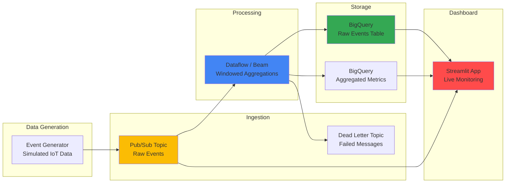

# Real-Time Streaming Pipeline Dashboard with Pub/Sub, Dataflow, and BigQuery

## Problem

Organizations processing real-time event streams — IoT sensor readings, clickstream data, financial transactions — need visibility into their streaming pipelines. Without a dedicated monitoring dashboard, engineers rely on scattered Cloud Console pages to track message throughput, processing latency, and pipeline health. Debugging issues like backpressure, late data, or dead-letter queue buildup requires jumping between Pub/Sub metrics, Dataflow job graphs, and BigQuery query results, making incident response slow and error-prone.

## Solution

This project builds an end-to-end streaming pipeline (data generator → Pub/Sub → Dataflow/Beam → BigQuery) paired with a Streamlit dashboard that provides real-time visibility into every stage. The dashboard shows live message throughput, windowed aggregations, pipeline architecture, and the latest records landing in BigQuery. A simulated data generator produces configurable IoT-style events, making the entire pipeline self-contained and demonstrable without external data sources.

## Architecture Diagram



## Prerequisites

1. Google Cloud account with Pub/Sub, Dataflow, BigQuery, and Cloud Storage APIs enabled
2. Google Cloud CLI installed and configured (or Cloud Shell)
3. Python 3.9+ with Apache Beam SDK installed
4. Docker installed (for Cloud Run deployment)
5. Basic knowledge of streaming concepts (windowing, watermarks, exactly-once)
6. Estimated cost: **$5 – $15** (Dataflow worker charges are the primary cost; use `n1-standard-1` to minimize)

> **Note**: Dataflow jobs incur charges while running. Stop the pipeline after testing to avoid ongoing costs.

## Preparation

```bash
# Set environment variables
export PROJECT_ID=$(gcloud config get-value project)
export REGION="us-central1"
RANDOM_SUFFIX=$(openssl rand -hex 3)

# Enable required APIs
gcloud services enable pubsub.googleapis.com
gcloud services enable dataflow.googleapis.com
gcloud services enable bigquery.googleapis.com
gcloud services enable storage.googleapis.com
gcloud services enable run.googleapis.com

# Create a Cloud Storage bucket for Dataflow staging
export BUCKET_NAME="stream-pipeline-${RANDOM_SUFFIX}"
gsutil mb -p ${PROJECT_ID} -c STANDARD -l ${REGION} gs://${BUCKET_NAME}

# Create BigQuery dataset
export BQ_DATASET="streaming_pipeline"
bq mk --dataset --location=${REGION} ${PROJECT_ID}:${BQ_DATASET}

# Create project directory
mkdir -p real-time-streaming-pipeline-dashboard/src
cd real-time-streaming-pipeline-dashboard

echo "✅ Project configured"
echo "✅ GCS bucket: ${BUCKET_NAME}"
echo "✅ BQ dataset: ${BQ_DATASET}"
```

## Steps

1. **Create Pub/Sub Topics and Subscriptions**:

   Set up the messaging infrastructure — a main topic for raw events, a dead-letter topic for failed messages, and subscriptions for both the Dataflow pipeline and the Streamlit dashboard.

   ```bash
   # Create main topic and dead-letter topic
   export TOPIC_NAME="iot-events-${RANDOM_SUFFIX}"
   export DLQ_TOPIC="iot-events-dlq-${RANDOM_SUFFIX}"

   gcloud pubsub topics create ${TOPIC_NAME}
   gcloud pubsub topics create ${DLQ_TOPIC}

   # Subscription for Dataflow pipeline
   gcloud pubsub subscriptions create "${TOPIC_NAME}-dataflow-sub" \
       --topic=${TOPIC_NAME} \
       --ack-deadline=60 \
       --dead-letter-topic=${DLQ_TOPIC} \
       --max-delivery-attempts=5

   # Subscription for dashboard (pull-based monitoring)
   gcloud pubsub subscriptions create "${TOPIC_NAME}-dashboard-sub" \
       --topic=${TOPIC_NAME} \
       --ack-deadline=30

   # DLQ subscription for monitoring
   gcloud pubsub subscriptions create "${DLQ_TOPIC}-sub" \
       --topic=${DLQ_TOPIC}

   echo "✅ Pub/Sub topics and subscriptions created"
   ```

2. **Create the IoT Event Generator**:

   A Python script that simulates IoT sensor readings (temperature, humidity, pressure) from multiple devices, publishing JSON messages to Pub/Sub at a configurable rate.

   ```bash
   cat > src/__init__.py << 'PYEOF'
PYEOF

   cat > src/generator.py << 'PYEOF'
import json
import time
import random
import argparse
from datetime import datetime, timezone
from google.cloud import pubsub_v1

DEVICE_IDS = [f"sensor-{i:03d}" for i in range(1, 21)]
LOCATIONS = ["warehouse-A", "warehouse-B", "factory-floor", "outdoor", "cold-storage"]


def generate_event() -> dict:
    """Generate a single simulated IoT sensor event."""
    device = random.choice(DEVICE_IDS)
    return {
        "device_id": device,
        "timestamp": datetime.now(timezone.utc).isoformat(),
        "location": random.choice(LOCATIONS),
        "temperature_c": round(random.gauss(22.0, 5.0), 2),
        "humidity_pct": round(random.uniform(30, 90), 2),
        "pressure_hpa": round(random.gauss(1013.25, 10.0), 2),
        "battery_pct": round(random.uniform(10, 100), 1),
    }


def publish_events(project_id: str, topic_name: str, rate: int = 10, duration: int = 300):
    """Publish events to Pub/Sub at the given rate (events/sec) for duration seconds."""
    publisher = pubsub_v1.PublisherClient()
    topic_path = publisher.topic_path(project_id, topic_name)

    total_sent = 0
    start = time.time()

    print(f"Publishing {rate} events/sec to {topic_path} for {duration}s...")

    while time.time() - start < duration:
        batch_start = time.time()
        for _ in range(rate):
            event = generate_event()
            data = json.dumps(event).encode("utf-8")
            publisher.publish(topic_path, data=data, device_id=event["device_id"])
            total_sent += 1

        # Sleep to maintain target rate
        elapsed = time.time() - batch_start
        if elapsed < 1.0:
            time.sleep(1.0 - elapsed)

    print(f"✅ Published {total_sent:,} events in {time.time() - start:.1f}s")


if __name__ == "__main__":
    parser = argparse.ArgumentParser()
    parser.add_argument("--project", required=True)
    parser.add_argument("--topic", required=True)
    parser.add_argument("--rate", type=int, default=10)
    parser.add_argument("--duration", type=int, default=300)
    args = parser.parse_args()

    publish_events(args.project, args.topic, args.rate, args.duration)
PYEOF

   echo "✅ IoT event generator created"
   ```

3. **Create the Apache Beam / Dataflow Pipeline**:

   The pipeline reads from Pub/Sub, parses JSON events, applies tumbling-window aggregations (average temperature, humidity per location per minute), and writes both raw events and aggregated metrics to BigQuery.

   ```bash
   cat > src/beam_pipeline.py << 'PYEOF'
import json
import argparse
import apache_beam as beam
from apache_beam.options.pipeline_options import PipelineOptions, StandardOptions
from apache_beam.transforms.window import FixedWindows
from apache_beam.io.gcp.bigquery import WriteToBigQuery, BigQueryDisposition
from datetime import datetime

RAW_SCHEMA = {
    "fields": [
        {"name": "device_id", "type": "STRING"},
        {"name": "timestamp", "type": "TIMESTAMP"},
        {"name": "location", "type": "STRING"},
        {"name": "temperature_c", "type": "FLOAT"},
        {"name": "humidity_pct", "type": "FLOAT"},
        {"name": "pressure_hpa", "type": "FLOAT"},
        {"name": "battery_pct", "type": "FLOAT"},
        {"name": "ingested_at", "type": "TIMESTAMP"},
    ]
}

AGG_SCHEMA = {
    "fields": [
        {"name": "window_start", "type": "TIMESTAMP"},
        {"name": "window_end", "type": "TIMESTAMP"},
        {"name": "location", "type": "STRING"},
        {"name": "avg_temperature_c", "type": "FLOAT"},
        {"name": "avg_humidity_pct", "type": "FLOAT"},
        {"name": "event_count", "type": "INTEGER"},
    ]
}


class ParseEvent(beam.DoFn):
    def process(self, element):
        try:
            record = json.loads(element.decode("utf-8"))
            record["ingested_at"] = datetime.utcnow().isoformat()
            yield record
        except Exception as e:
            # Route to dead letter
            yield beam.pvalue.TaggedOutput("dead_letter", element)


class AggregateByLocation(beam.DoFn):
    def process(self, element, window=beam.DoFn.WindowParam):
        location, events = element
        events = list(events)
        yield {
            "window_start": window.start.to_utc_datetime().isoformat(),
            "window_end": window.end.to_utc_datetime().isoformat(),
            "location": location,
            "avg_temperature_c": round(sum(e["temperature_c"] for e in events) / len(events), 2),
            "avg_humidity_pct": round(sum(e["humidity_pct"] for e in events) / len(events), 2),
            "event_count": len(events),
        }


def run(argv=None):
    parser = argparse.ArgumentParser()
    parser.add_argument("--input_subscription", required=True)
    parser.add_argument("--raw_table", required=True, help="project:dataset.table")
    parser.add_argument("--agg_table", required=True, help="project:dataset.table")
    parser.add_argument("--window_size", type=int, default=60, help="Window size in seconds")
    known_args, pipeline_args = parser.parse_known_args(argv)

    options = PipelineOptions(pipeline_args)
    options.view_as(StandardOptions).streaming = True

    with beam.Pipeline(options=options) as p:
        # Read from Pub/Sub
        messages = (
            p
            | "ReadPubSub" >> beam.io.ReadFromPubSub(subscription=known_args.input_subscription)
            | "ParseJSON" >> beam.ParDo(ParseEvent()).with_outputs("dead_letter", main="parsed")
        )

        parsed = messages.parsed

        # Write raw events to BigQuery
        parsed | "WriteRaw" >> WriteToBigQuery(
            known_args.raw_table,
            schema=RAW_SCHEMA,
            create_disposition=BigQueryDisposition.CREATE_IF_NEEDED,
            write_disposition=BigQueryDisposition.WRITE_APPEND,
        )

        # Windowed aggregation by location
        (
            parsed
            | "AddWindow" >> beam.WindowInto(FixedWindows(known_args.window_size))
            | "KeyByLocation" >> beam.Map(lambda e: (e["location"], e))
            | "GroupByLocation" >> beam.GroupByKey()
            | "Aggregate" >> beam.ParDo(AggregateByLocation())
            | "WriteAgg" >> WriteToBigQuery(
                known_args.agg_table,
                schema=AGG_SCHEMA,
                create_disposition=BigQueryDisposition.CREATE_IF_NEEDED,
                write_disposition=BigQueryDisposition.WRITE_APPEND,
            )
        )


if __name__ == "__main__":
    run()
PYEOF

   echo "✅ Apache Beam pipeline created"
   ```

4. **Create the Streamlit Dashboard**:

   The dashboard provides live monitoring of the streaming pipeline with auto-refreshing metrics, charts, and a BigQuery result viewer.

   ```bash
   cat > app.py << 'PYEOF'
import streamlit as st
import pandas as pd
import plotly.express as px
from google.cloud import bigquery, pubsub_v1
from datetime import datetime, timedelta, timezone
import json
import os

st.set_page_config(page_title="Streaming Pipeline Dashboard", page_icon="📡", layout="wide")
st.title("Real-Time Streaming Pipeline Dashboard")

PROJECT_ID = os.environ.get("PROJECT_ID", "")
BQ_DATASET = os.environ.get("BQ_DATASET", "streaming_pipeline")

client = bigquery.Client(project=PROJECT_ID)

# ── Architecture tab and metrics ─────────────────────────────
tab_arch, tab_live, tab_agg, tab_dlq = st.tabs(
    ["Architecture", "Live Events", "Aggregations", "Dead Letter Queue"]
)

# ── Architecture ─────────────────────────────────────────────
with tab_arch:
    st.subheader("Pipeline Architecture")
    st.markdown("""
    ```
    IoT Sensors ──▶ Pub/Sub Topic ──▶ Dataflow (Beam) ──▶ BigQuery
                                           │                  ├── raw_events
                                           │                  └── agg_metrics
                                           └── Dead Letter Topic
    ```
    """)

    st.markdown("**Pipeline Components:**")
    col1, col2, col3, col4 = st.columns(4)
    col1.info("**Pub/Sub**\n\nIngests raw IoT events at scale")
    col2.info("**Dataflow**\n\nApplies windowed aggregations")
    col3.info("**BigQuery**\n\nStores raw + aggregated data")
    col4.info("**Streamlit**\n\nReal-time monitoring UI")

# ── Live Events ──────────────────────────────────────────────
with tab_live:
    st.subheader("Latest Raw Events")
    auto_refresh = st.checkbox("Auto-refresh (10s)", value=False)

    query_raw = f"""
        SELECT *
        FROM `{PROJECT_ID}.{BQ_DATASET}.raw_events`
        ORDER BY timestamp DESC
        LIMIT 100
    """
    try:
        df_raw = client.query(query_raw).to_dataframe()
        st.metric("Events in last query", len(df_raw))
        st.dataframe(df_raw, use_container_width=True)

        if not df_raw.empty and "device_id" in df_raw.columns:
            device_counts = df_raw["device_id"].value_counts().reset_index()
            device_counts.columns = ["device_id", "count"]
            fig = px.bar(device_counts, x="device_id", y="count", title="Events per Device (last 100)")
            st.plotly_chart(fig, use_container_width=True)
    except Exception as e:
        st.warning(f"Could not query raw_events table. Pipeline may not have written data yet.\n\n{e}")

    if auto_refresh:
        st.rerun()

# ── Aggregations ─────────────────────────────────────────────
with tab_agg:
    st.subheader("Windowed Aggregations")

    query_agg = f"""
        SELECT *
        FROM `{PROJECT_ID}.{BQ_DATASET}.agg_metrics`
        ORDER BY window_start DESC
        LIMIT 200
    """
    try:
        df_agg = client.query(query_agg).to_dataframe()
        st.dataframe(df_agg, use_container_width=True)

        if not df_agg.empty:
            fig_temp = px.line(
                df_agg,
                x="window_start",
                y="avg_temperature_c",
                color="location",
                title="Avg Temperature by Location (per window)"
            )
            st.plotly_chart(fig_temp, use_container_width=True)

            fig_count = px.bar(
                df_agg,
                x="window_start",
                y="event_count",
                color="location",
                title="Event Count by Location (per window)"
            )
            st.plotly_chart(fig_count, use_container_width=True)
    except Exception as e:
        st.warning(f"Could not query agg_metrics table.\n\n{e}")

# ── Dead Letter Queue ────────────────────────────────────────
with tab_dlq:
    st.subheader("Dead Letter Queue Monitor")
    st.markdown("Messages that failed processing after max delivery attempts appear here.")

    dlq_sub = os.environ.get("DLQ_SUBSCRIPTION", "")
    if dlq_sub:
        try:
            subscriber = pubsub_v1.SubscriberClient()
            sub_path = subscriber.subscription_path(PROJECT_ID, dlq_sub)
            response = subscriber.pull(subscription=sub_path, max_messages=10, timeout=5)

            if response.received_messages:
                dlq_data = []
                for msg in response.received_messages:
                    dlq_data.append({
                        "message_id": msg.message.message_id,
                        "data": msg.message.data.decode("utf-8", errors="replace"),
                        "publish_time": msg.message.publish_time.isoformat(),
                    })
                st.dataframe(pd.DataFrame(dlq_data), use_container_width=True)
                st.metric("DLQ Messages", len(dlq_data))
            else:
                st.success("No messages in Dead Letter Queue")
        except Exception as e:
            st.info(f"Could not pull from DLQ: {e}")
    else:
        st.info("Set DLQ_SUBSCRIPTION environment variable to enable DLQ monitoring.")
PYEOF

   echo "✅ Streamlit dashboard created"
   ```

5. **Create Requirements, Config, and Dockerfile**:

   ```bash
   cat > requirements.txt << 'EOF'
streamlit>=1.31.0
google-cloud-bigquery>=3.17.0
google-cloud-pubsub>=2.19.0
apache-beam[gcp]>=2.53.0
pandas>=2.1.0
plotly>=5.18.0
db-dtypes>=1.2.0
pyarrow>=14.0.0
EOF

   mkdir -p .streamlit

   cat > .streamlit/config.toml << 'EOF'
[theme]
primaryColor = "#FBBC04"
backgroundColor = "#FFFFFF"
secondaryBackgroundColor = "#F0F2F6"
textColor = "#1F1F1F"
font = "sans serif"

[server]
headless = true
port = 8080
EOF

   cat > Dockerfile << 'EOF'
FROM python:3.11-slim

WORKDIR /app
COPY requirements.txt .
RUN pip install --no-cache-dir -r requirements.txt

COPY . .

EXPOSE 8080
CMD ["streamlit", "run", "app.py", "--server.port=8080", "--server.address=0.0.0.0"]
EOF

   echo "✅ Requirements, config, and Dockerfile created"
   ```

6. **Launch the Dataflow Pipeline**:

   Submit the Beam pipeline to Dataflow as a streaming job. This is the core of the project — a production-grade streaming pipeline running on managed infrastructure.

   ```bash
   export SUBSCRIPTION_PATH="projects/${PROJECT_ID}/subscriptions/${TOPIC_NAME}-dataflow-sub"
   export RAW_TABLE="${PROJECT_ID}:${BQ_DATASET}.raw_events"
   export AGG_TABLE="${PROJECT_ID}:${BQ_DATASET}.agg_metrics"

   python3 src/beam_pipeline.py \
       --input_subscription=${SUBSCRIPTION_PATH} \
       --raw_table=${RAW_TABLE} \
       --agg_table=${AGG_TABLE} \
       --window_size=60 \
       --runner=DataflowRunner \
       --project=${PROJECT_ID} \
       --region=${REGION} \
       --temp_location=gs://${BUCKET_NAME}/temp \
       --staging_location=gs://${BUCKET_NAME}/staging \
       --job_name="iot-streaming-pipeline-${RANDOM_SUFFIX}" \
       --machine_type=n1-standard-1 \
       --max_num_workers=2 \
       --streaming

   echo "✅ Dataflow streaming pipeline launched"
   ```

7. **Start the Event Generator**:

   ```bash
   # Run generator for 5 minutes at 10 events/sec
   python3 src/generator.py \
       --project=${PROJECT_ID} \
       --topic=${TOPIC_NAME} \
       --rate=10 \
       --duration=300 &

   echo "✅ Event generator running in background"
   ```

8. **Deploy the Dashboard to Cloud Run**:

   ```bash
   export IMAGE_URI="${REGION}-docker.pkg.dev/${PROJECT_ID}/streamlit-apps/streaming-dashboard:latest"

   gcloud builds submit --tag ${IMAGE_URI} .

   gcloud run deploy streaming-dashboard \
       --image=${IMAGE_URI} \
       --region=${REGION} \
       --platform=managed \
       --allow-unauthenticated \
       --memory=1Gi \
       --cpu=1 \
       --port=8080 \
       --set-env-vars="PROJECT_ID=${PROJECT_ID},BQ_DATASET=${BQ_DATASET},DLQ_SUBSCRIPTION=${DLQ_TOPIC}-sub"

   SERVICE_URL=$(gcloud run services describe streaming-dashboard \
       --region=${REGION} --format="value(status.url)")

   echo "✅ Dashboard deployed: ${SERVICE_URL}"
   ```

## Validation & Testing

1. Verify Pub/Sub messages are flowing:

   ```bash
   gcloud pubsub subscriptions pull "${TOPIC_NAME}-dashboard-sub" \
       --limit=5 --auto-ack --format=json
   ```

   Expected output: JSON messages with `device_id`, `temperature_c`, etc.

2. Verify Dataflow job is running:

   ```bash
   gcloud dataflow jobs list --region=${REGION} --status=active \
       --format="table(id,name,state,createTime)"
   ```

   Expected output: One active streaming job.

3. Verify data in BigQuery:

   ```bash
   bq query --use_legacy_sql=false \
       "SELECT COUNT(*) as cnt FROM \`${PROJECT_ID}.${BQ_DATASET}.raw_events\`"

   bq query --use_legacy_sql=false \
       "SELECT * FROM \`${PROJECT_ID}.${BQ_DATASET}.agg_metrics\` ORDER BY window_start DESC LIMIT 5"
   ```

   Expected output: Growing row counts in raw_events, windowed aggregation rows in agg_metrics.

## Cleanup

```bash
# Stop Dataflow job
JOB_ID=$(gcloud dataflow jobs list --region=${REGION} --status=active \
    --format="value(id)" | head -1)
gcloud dataflow jobs cancel ${JOB_ID} --region=${REGION}

# Delete Cloud Run service
gcloud run services delete streaming-dashboard --region=${REGION} --quiet

# Delete Pub/Sub resources
gcloud pubsub subscriptions delete "${TOPIC_NAME}-dataflow-sub" --quiet
gcloud pubsub subscriptions delete "${TOPIC_NAME}-dashboard-sub" --quiet
gcloud pubsub subscriptions delete "${DLQ_TOPIC}-sub" --quiet
gcloud pubsub topics delete ${TOPIC_NAME} --quiet
gcloud pubsub topics delete ${DLQ_TOPIC} --quiet

# Delete BigQuery dataset
bq rm -r -f ${PROJECT_ID}:${BQ_DATASET}

# Delete GCS bucket
gsutil -m rm -r gs://${BUCKET_NAME}

# Delete container image
gcloud artifacts docker images delete ${IMAGE_URI} --quiet

echo "✅ All resources cleaned up"
```

## Discussion

This project demonstrates the canonical GCP streaming architecture tested heavily on the Professional Data Engineering exam: Pub/Sub for ingestion, Dataflow (Apache Beam) for processing, and BigQuery for analytics. The combination of these three services is the most common pattern for real-time data engineering on GCP.

Key concepts demonstrated include: **windowed aggregations** (fixed/tumbling windows), **dead-letter queues** for handling poison messages, **exactly-once processing** guarantees provided by Dataflow, and **streaming inserts** to BigQuery. The Beam pipeline code shows both raw event passthrough and windowed aggregation, covering the two most common streaming patterns.

The Streamlit dashboard adds portfolio value by making the pipeline observable — interviewers can see data flowing through the system in real time rather than just reading code. The architecture diagram and DLQ monitoring tab show awareness of production concerns beyond just "make it work."

> **Tip**: During portfolio presentations, start the event generator live and show data appearing in the dashboard in real time. This makes a much stronger impression than static screenshots.

## Challenge

1. **Add session windowing**: Implement session windows that group events per device with a 30-second gap timeout.
2. **Add watermark tracking**: Display Dataflow watermark progress in the dashboard to demonstrate late-data handling.
3. **Add alerting**: Trigger a Cloud Function when average temperature exceeds a threshold, sending a Pub/Sub notification.
4. **Add exactly-once deduplication**: Implement message deduplication using Pub/Sub message attributes.
5. **Add backfill capability**: Create a batch Beam pipeline that reads historical data from GCS and writes to the same BigQuery tables.
